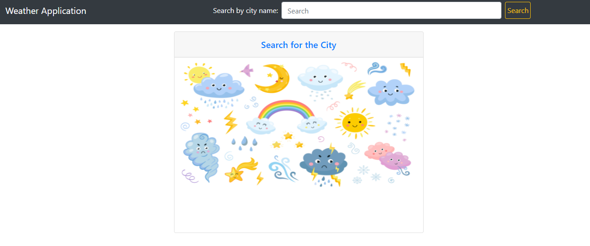
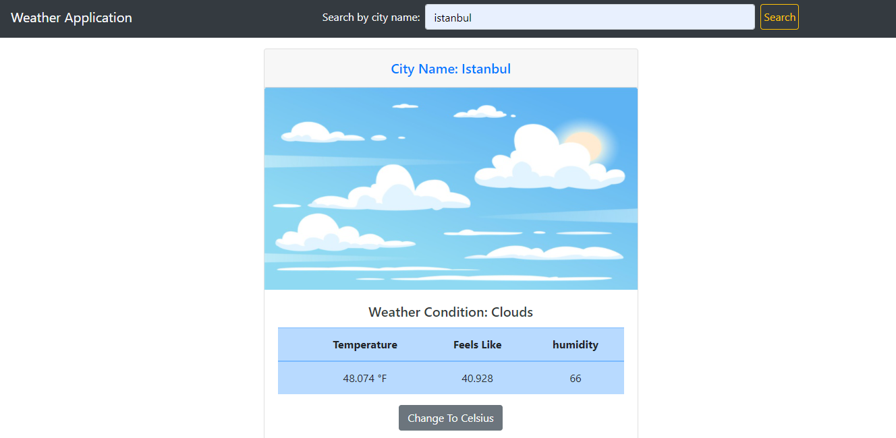
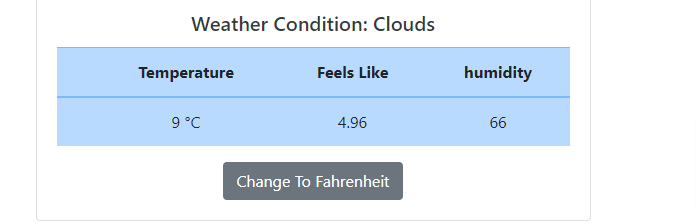

# Weather App

>This is a web application for educational purposes. I created a simple weather app by using weather API. This app enable the user to search by city name to get the weather, and enable user to swap between celsius to fahrenheit and versus. For each weather condition the image changes.


## Home page:
 


## Result:


## Change button:




## Built With

- Javascript.
- HTML , CSS , Bootstrap.
- Webpack and CLI.


## Getting Started

To get a local copy up and running follow these simple example steps.

### Setup

**STEP 1**
In the terminal, Run the following commands.

```bash
git clone https://github.com/AhmedAmin90/WeatherApp-API

cd WeatherApp-API
```

**STEP 2**
- Then open `dist` folder, then open `index.html` file using a browser.

## Authors

👤 **Ahmed Amin**

- GitHub: [@AhmedAmin90](https://github.com/AhmedAmin90)
- Twitter: [@AhmedAmin12383](https://twitter.com/AhmedAmin12383)
- LinkedIn: [Ahmed Amin](https://www.linkedin.com/in/web-developer/)


## 🤝 Contributing

Contributions, issues, and feature requests are welcome!

Feel free to check the [issues page]((https://github.com/AhmedAmin90/WeatherApp-API/issues)).

## Show your support

Give a ⭐️ if you like this project!

## License
<p>This project is <a href="./LICENSE">MIT</a> licensed.</p>